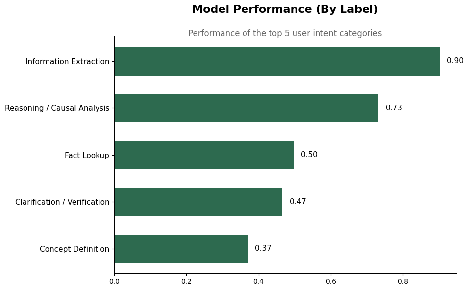

# Can LLMS Understand Intent?

## Understanding the "Why" Behind the Question
Navigating the nuances of human language is one of AI's greatest challenges. Before an artificial intelligence can provide a truly helpful answer, it first needs to understand the exact nature of the user's request—whether they are looking for raw facts, complex reasoning, or actionable advice.

## Problem Statement: The Challenge of Misaligned AI
As AI systems are integrated into more daily workflows, they are flooded with millions of diverse queries. However, most existing models suffer from a hidden "class imbalance" problem. They become very good at identifying broad, generic questions (the "noise"), but fail completely at recognizing specific, complex requests. When an AI cannot tell the difference between a user asking for a simple "Concept Definition" and a user asking for deep "Reasoning and Causal Analysis," the resulting answers are misaligned, unhelpful, and ultimately frustrate users who are seeking targeted information.

## Solution Description: A Specialized Intent Classification Engine
To solve this, we have developed a specialized, fine-tuned AI model designed strictly to categorize user queries into 16 distinct "Intents." By implementing an advanced weighting system during the training process, our model was forced to pay attention to both massive, common categories and highly specific, rare requests.

The result is a highly capable classification engine. Our model excels at identifying when users need to pull specific data from dense documents ("Information Extraction") and when they are asking the AI to think critically about cause and effect ("Reasoning / Causal Analysis"). By accurately detecting exactly what the user is trying to achieve, our system paves the way for precise, context-aware, and highly reliable AI responses across any industry or topic.

## Chart: Performance Highlights
The chart below highlights the predictive accuracy (F1 Score) of our model across the top five most successfully identified user intent categories. The model achieved an exceptional 90% accuracy in identifying Information Extraction requests, proving its reliability for serious research and data analysis tasks.

Figure 1 -- Model Performance Across Labels